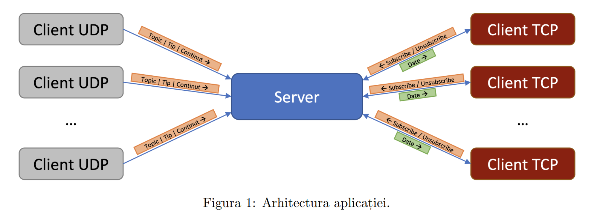
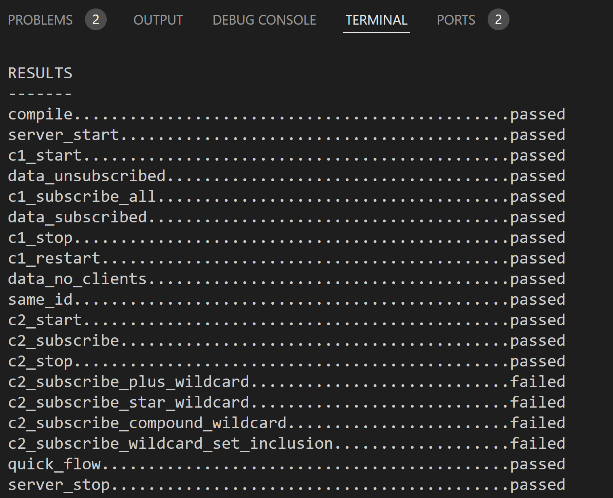

# Tema-2-PCom
Tema 2 Protocoale de Comunicatii (2024)
Acest program este un sistem de comunicare bazat pe modelul client-server. Serverul primeste cereri si trimite informatii catre clienti, iar clientii pot trimite cereri si pot primi informatii de la server.

In scrierea codului, am avut in vedere schema din enunt cu arhitectura aplicatiei:

Serverul functioneaza ca un intermediar de informatie intre clientii UDP si clientii TCP.

Am ales sa organizez aplicatia in 3 fisiere principale:
 
- server.c (implementarea serverului si gestionarea clientilor UDP)
- subscriber.c (gestionarea clientilor TCP)
- header.h (diferite structuri pe care le-am considerat necesare pe parcursul scrierii programului)

### SERVERUL

Dupa cum am mentionat mai devreme, serverul este conceput pentru a gestiona comunicatia intre clientii UDP si clientii TCP, actionand ca un intermediar de informatii. Prin intermediul sau, clientii UDP pot trimite pachete catre server, iar acesta redistribuie mesajele catre clientii TCP, care sunt abonati la topicurile corespunzatoare.

**Procesarea pachetelor UDP primite**

> Serverul extrage informatiile relevante din aceste pachete, precum tipul de date si continutul mesajului, si le transforma in structuri de date adecvate pentru a fi transmise mai departe clientilor TCP. Astfel, clientii TCP pot primi informatii de la clientii UDP intr-un mod eficient si structurat.

**Gestionarea comenzilor (subscribe/unsubscribe)**

> In paralel, serverul accepta conexiuni TCP de la clienti si gestioneaza abonarile si dezabonarile acestora la diversele topicuri. Prin intermediul comenzilor de subscriere si dezabonare trimise de clientii TCP, serverul actualizeaza lista de topicuri la care sunt abonati clientii si decide ce mesaje trebuie trimise catre fiecare client TCP in functie de topicurile la care este abonat.

**Gestionare reconectari clienti TCP**

> Servarul identifica si gestioneaza reconectarile clientilor TCP. Astfel, daca un client TCP este deja conectat si incearca sa se reconecteze, serverul ii actualizeaza socketul si starea de conectare => comunicare neintrerupta intre client si server. :))

### SUBSCRIBERII

Implementarea din subscriber.c permite clientilor sa se aboneze, sa se dezaboneze si sa primeasca mesaje de la server.

Programul primeste trei argumente de la linia de comanda: adresa IP a serverului, portul la care sa se conecteze si numarul portului pe care sa asculte.

> Se creeaza un socket TCP si ne conectam la server folosind adresa IP si portul specificate. Apoi trimitem adresa IP la server si initializam structura pentru mesajul care va fi trimis serverului.

> Am o bucla principala (while) in care se asteapta evenimente fie de la server, fie de la intrarea standard (STDIN). Daca se primesc informatii de la server, le afisam pe ecran conform formatului specific din enunt (semn ca s-a primit ceva informatie legata de un topic la care un client este abonat). Daca se primesc comenzi STDIN (subscribe/unsubscribe), se proceseaza aceste comenzi si se trimit catre server.

**Protocol eficient (structuri de
mesaje peste TCP) pentru reprezentarea mesajelor**

> Protocolul eficient implementat in aplicatie utilizeaza structuri de mesaje pentru a organiza si transmite datele intre client si server prin TCP. Aceste structuri, definite clar in cod (in header.h), asigura o comunicare standardizata si usor de inteles pentru ambele parti implicate.
Fiecare mesaj are o structura bine definita, inclusiv campuri precum tipul de informatie, topicul, adresa IP, portul si continutul mesajului. De exemplu, in cadrul aplicatiei de abonare, un mesaj de abonare la un anumit topic ar include tipul de comanda (subscribe/unsubscribe) si numele topicului.

> Protocolul optimizeaza transmiterea datelor prin TCP, luand in considerare performanta si eficienta retelei. => prin minimizarea dimensiunii mesajelor trimise si evitarea utilizarii excesive a latimii de banda. Astfel, se reduc timpii de intarziere si se imbunatateste experienta utilizatorului.

> In plus, protocolul ofera o gestionare a erorilor, inclusiv detectarea si tratarea corecta a situatiilor neasteptate sau a problemelor de conexiune intampinate pe parcursul comunicarii intre client si server.

**Formatul mesajelor:**

- mesajele sunt serializate sub forma de siruri de biti si sunt impachetate in structuri de date specifice (command_tcp, tcp_struct, udp_struct)
- mesajele sunt trimise peste conexiunea TCP folosind operatiile de trimitere si primire (send() si recv())

**Tratarea erorilor:**

- protocolul implementeaza verificarea erorilor la fiecare pas important, cum ar fi deschiderea si conectarea socketului, trimiterea si primirea mesajelor etc.
- in cazul unei erori, se afiseaza un mesaj corespunzator si se incheie executia programului

**Mentiuni:**
- am utilizat in header.h un macro pentru DIE, pe care l-am preluat din resursele de pe OCW, las aici link: https://ocw.cs.pub.ro/courses/so/laboratoare/resurse/die
- structurile, de asemenea, sunt bazate pe ceea ce am avut la dispozitie in scheletele laboratoarelor 7-9, precum si comenzile si flow-ul in mare din fisierele server.c si subscriber.c
- pot exista situatii de alocare a socket fd-urilor care imi cauzeaza o oarecare intarziere a mesajului ce confirma `Starting subscriber C1` in situatii exceptionale pe care nu le-am intalnit cand rulez manual
- nu am reusit sa finalizez implementarea pentru wildcard-uri in timp util, am lasat doar ca idee functiile pe care aveam de gand sa le aplic si de la care sa pornesc (matches_topic si add_subscription). Trec toate testele de pe checker, cu exceptia celor 4 care folosesc wildcard-uri:

